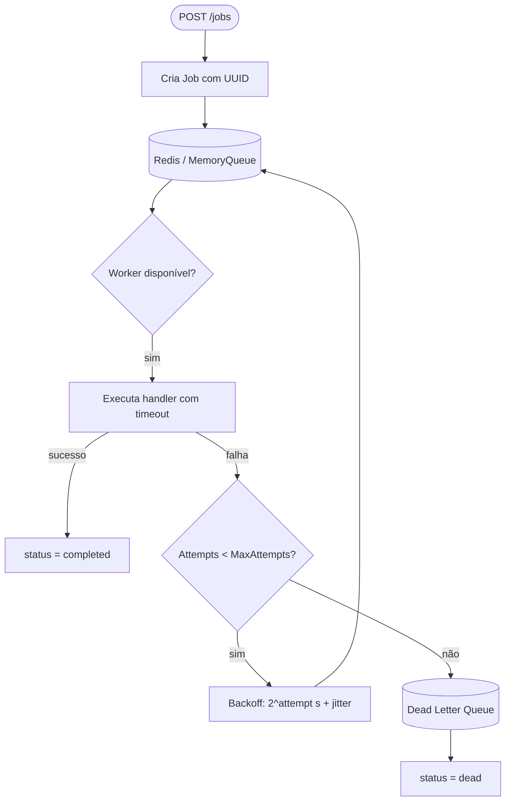

# GoWorkers

**Processador de tarefas em background resiliente e distribuído em Go.**

[](https://github.com/IsraelMends/goworkers/actions/workflows/ci.yml)
[](https://golang.org)
[](LICENSE)

GoWorkers é um job processor escrito em Go que demonstra o domínio de **concorrência real** na linguagem: goroutines, channels, context propagation, graceful shutdown, exponential backoff e observabilidade com Prometheus.

---

## Arquitetura

```
┌─────────────────┐      POST /jobs       ┌───────────────────────────┐
│   API Client    │ ─────────────────────▶ │     HTTP API (Chi)        │
└─────────────────┘                        └───────────┬───────────────┘
                                                       │ Enqueue
                                                       ▼
                                           ┌───────────────────────────┐
                                           │   Queue (Redis / Memory)  │
                                           └───────────┬───────────────┘
                                                       │ Dequeue (blocking)
                                                       ▼
                                           ┌───────────────────────────┐
                                           │       Worker Pool         │
                                           │  (N goroutines paralelas) │
                                           └───────────┬───────────────┘
                                                       │ executa
                                                       ▼
                                           ┌───────────────────────────┐
                                           │     Handler Registry      │
                                           │  type → HandlerFunc(ctx)  │
                                           └───────────┬───────────────┘
                                                       │
                              ┌────────────────────────┼────────────────────────┐
                              ▼                        ▼                        ▼
                         ✅ Sucesso               ❌ Falha (retry)         💀 DLQ
                    status=completed          exponential backoff      status=dead
                                               + jitter, re-enqueue
```

### Diagrama de fluxo de um job



---

## Funcionalidades

| Funcionalidade | Status |
|---|---|
| Worker pool com N goroutines | ✅ |
| Retry automático (exponential backoff + jitter) | ✅ |
| Dead Letter Queue | ✅ |
| Timeout por job (context.WithTimeout) | ✅ |
| Proteção contra panic nos handlers | ✅ |
| Graceful shutdown | ✅ |
| Fila em memória (desenvolvimento) | ✅ |
| Fila Redis (produção) | ✅ |
| API HTTP REST (Chi) | ✅ |
| Logging estruturado JSON (slog) | ✅ |
| Métricas Prometheus em `/metrics` | ✅ |
| Testes com race detector | ✅ |
| Dockerfile multi-stage | ✅ |
| docker-compose (app + Redis + Prometheus + Grafana) | ✅ |
| GitHub Actions CI | ✅ |

---

## Como rodar

### Pré-requisitos

```bash
go version        # Go 1.23+
docker --version  # Docker 24+
docker compose version
```

### Opção 1 — Com Docker Compose (recomendado)

```bash
# Sobe tudo: app + Redis + Prometheus + Grafana
docker compose -f deployments/docker-compose.yml up --build

# Parar
docker compose -f deployments/docker-compose.yml down
```

Serviços disponíveis:
- **App**: http://localhost:8080
- **Prometheus**: http://localhost:9090
- **Grafana**: http://localhost:3000 (admin / admin)

### Opção 2 — Desenvolvimento local (sem Docker)

```bash
# Sem REDIS_ADDR definido, usa MemoryQueue automaticamente
go run ./cmd/server/

# Ou com Redis local:
REDIS_ADDR=localhost:6379 go run ./cmd/server/
```

---

## API Reference

### `POST /jobs` — Enfileirar um job

```bash
curl -X POST http://localhost:8080/jobs \
  -H "Content-Type: application/json" \
  -d '{
    "type": "send_email",
    "payload": {
      "to": "user@example.com",
      "subject": "Olá!",
      "body": "Mensagem de teste"
    },
    "max_attempts": 3
  }'
```

Resposta `201 Created`:
```json
{
  "id": "550e8400-e29b-41d4-a716-446655440000",
  "type": "send_email",
  "payload": { "to": "user@example.com", "subject": "Olá!", "body": "Mensagem de teste" },
  "status": "pending",
  "attempts": 0,
  "max_attempts": 3,
  "created_at": "2026-06-01T10:00:00Z",
  "updated_at": "2026-06-01T10:00:00Z"
}
```

### `GET /jobs/{id}` — Consultar status de um job

```bash
curl http://localhost:8080/jobs/550e8400-e29b-41d4-a716-446655440000
```

Resposta `200 OK`:
```json
{
  "id": "550e8400-e29b-41d4-a716-446655440000",
  "type": "send_email",
  "status": "completed",
  "attempts": 1,
  "max_attempts": 3,
  "created_at": "2026-06-01T10:00:00Z",
  "updated_at": "2026-06-01T10:00:01Z"
}
```

### `GET /jobs` — Listar todos os jobs

```bash
curl http://localhost:8080/jobs
```

### `GET /healthz` — Health check

```bash
curl http://localhost:8080/healthz
# 200 OK
```

### `GET /metrics` — Métricas Prometheus

```bash
curl http://localhost:8080/metrics | grep goworkers
```

Métricas expostas:

| Métrica | Tipo | Descrição |
|---|---|---|
| `goworkers_jobs_enqueued_total` | Counter | Jobs enfileirados por tipo |
| `goworkers_jobs_completed_total` | Counter | Jobs completados com sucesso por tipo |
| `goworkers_jobs_failed_total` | Counter | Jobs que falharam (incluindo retries) por tipo |
| `goworkers_jobs_dead_lettered_total` | Counter | Jobs enviados para DLQ por tipo |
| `goworkers_job_retries_total` | Counter | Retries realizados por tipo |
| `goworkers_job_duration_seconds` | Histogram | Duração de execução por tipo e status |
| `goworkers_workers_active` | Gauge | Workers processando agora |
| `goworkers_queue_size` | Gauge | Jobs aguardando na fila |

---

## Tipos de jobs disponíveis

| Tipo | Payload | Descrição |
|---|---|---|
| `send_email` | `{ "to", "subject", "body" }` | Simula envio de email (100ms) |
| `generate_report` | `{}` | Simula geração de relatório (500ms) |
| `always_fail` | `{}` | Handler que sempre falha (teste de retry/DLQ) |
| `slow_job` | `{}` | Handler lento (5 min) — testa timeout |

---

## Configuração (variáveis de ambiente)

| Variável | Padrão | Descrição |
|---|---|---|
| `HTTP_ADDR` | `:8080` | Endereço do servidor HTTP |
| `WORKER_COUNT` | `4` | Número de workers concorrentes |
| `JOB_TIMEOUT` | `30s` | Timeout máximo por job |
| `QUEUE_BUFFER_SIZE` | `100` | Buffer do canal (MemoryQueue apenas) |
| `REDIS_ADDR` | `""` | Endereço Redis. Vazio = usa MemoryQueue |
| `REDIS_PASSWORD` | `""` | Senha do Redis |
| `REDIS_DB` | `0` | Database Redis |
| `LOG_LEVEL` | `info` | Nível de log: `debug`, `info`, `warn`, `error` |

---

## Testes

```bash
# Todos os testes com race detector
go test -race -timeout 120s ./...

# Apenas worker pool
go test -race -v ./internal/worker/...

# Testes de integração Redis (requer Docker)
go test -race -v ./internal/queue/...

# Cobertura
go test -coverprofile=coverage.out ./...
go tool cover -html=coverage.out
```

---

## Decisões Técnicas

### Por que Chi e não Gin?

Chi é mais idiomático em Go: usa `net/http` puro, `context` nativo, e middlewares são funções simples `func(http.Handler) http.Handler`. Gin tem um ecossistema maior, mas abstrai o stdlib de formas que mascaram como Go realmente funciona.

### Por que MemoryQueue com Dequeue retornando cópias?

O `Dequeue` retorna uma **cópia** do struct `Job` (não o ponteiro interno do mapa). Isso garante que o worker tenha propriedade exclusiva sobre o job durante o processamento — sem precisar de lock externo para modificar campos como `Attempts`. O race detector (`go test -race`) validou essa decisão.

### Por que Redis Listas e não Streams?

Redis Lists com `LPUSH`/`BRPOP` são suficientes para o MVP e muito simples de entender. Redis Streams adicionam grupos de consumidores e ACKs explícitos, o que seria necessário em modo multi-instância distribuído (etapa futura).

### Exponential backoff com jitter

```
delay = 2^attempt segundos + random(0..1s)
```

O **jitter** evita o *thundering herd*: quando vários jobs falham ao mesmo tempo e sem jitter tentariam retry exatamente no mesmo momento, sobrecarregando o sistema.

### Por que não usar `asynq`?

`asynq` é uma excelente biblioteca para produção, mas usá-la aqui esconderia todos os padrões de concorrência que este projeto tem como objetivo ensinar. O resultado seria "usar uma lib" em vez de "entender Go".

---

## Estrutura do projeto

```
goworkers/
├── cmd/server/main.go          # Entrypoint: bootstrap, graceful shutdown
├── internal/
│   ├── api/
│   │   ├── server.go           # Servidor HTTP, roteamento, middlewares
│   │   └── handlers.go         # Handlers: enqueue, get, list
│   ├── config/config.go        # Configuração via variáveis de ambiente
│   ├── domain/job.go           # Modelo de domínio: Job, JobStatus, HandlerFunc
│   ├── handler/
│   │   ├── registry.go         # Registro de handlers por tipo de job
│   │   └── examples.go         # Handlers de exemplo (email, report, etc.)
│   ├── metrics/metrics.go      # Definição das métricas Prometheus
│   ├── queue/
│   │   ├── queue.go            # Interface Queue
│   │   ├── memory_queue.go     # Implementação em memória (canais + mutex)
│   │   ├── redis_queue.go      # Implementação com Redis
│   │   └── redis_queue_test.go # Testes de integração com testcontainers
│   └── worker/
│       ├── worker.go           # Documentação do pacote
│       ├── pool.go             # Worker pool: scheduling, retry, DLQ, métricas
│       └── pool_test.go        # Testes: retry, DLQ, timeout, panic, shutdown
├── pkg/logger/logger.go        # Construtor de slog.Logger (JSON handler)
├── deployments/
│   ├── Dockerfile              # Multi-stage: builder (alpine) + runtime (scratch)
│   ├── docker-compose.yml      # app + redis + prometheus + grafana
│   └── prometheus.yml          # Scrape config
├── .github/workflows/ci.yml    # CI: test (race) + lint + build
└── .docs/                      # Especificação e guia do projeto
```

---

## Próximos passos

Ver seção **[Próximas funcionalidades](#próximas-funcionalidades)** para o roadmap pós-MVP.

### Próximas funcionalidades

1. **Jobs com delay** — Redis Sorted Sets com score = timestamp de execução futuro
2. **Prioridade de filas** — Múltiplas listas Redis, Dequeue por prioridade
3. **Reprocessamento de DLQ** — `POST /jobs/dlq/{id}/retry`
4. **Webhook de callback** — Notificar URL configurada quando job termina
5. **CLI com Cobra** — `goworkers enqueue`, `goworkers status`, `goworkers dlq`
6. **OpenTelemetry** — Tracing distribuído entre serviços
7. **Suporte multi-instância** — Usando Redis Streams com consumer groups

---

## Licença

MIT — veja [LICENSE](LICENSE).
